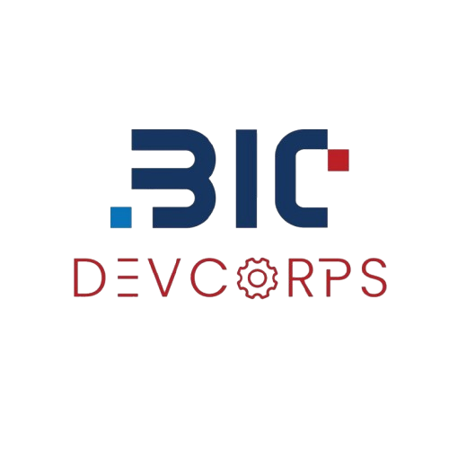

# MEMBER ENRICHMENT PROGRAM

  
  

## BIC AI HORIZON COMMUNITY

---

# PART 1

## GEMINI API

- https://ai.google.dev/gemini-api/docs/text-generation

## DOTENV

- https://www.npmjs.com/package/dotenv

---

# PART 2

## EXPRESS.JS

- https://expressjs.com/en/5x/starter/installing/

---

# PART 3

## REACT + VITE

- https://vite.dev/guide/

### CORS AND FIXES

- https://expressjs.com/en/resources/middleware/cors/

### FRONTEND AND BACKEND CONNECTION

### REACT CONTROLLED INPUT

- https://react.dev/reference/react-dom/components/input#controlling-an-input-with-a-state-variable

### PARSING BODY

- https://expressjs.com/en/5x/api/express/

### POST ENDPOINTS

- https://expressjs.com/en/5x/guide/routing/#route-methods
- https://expressjs.com/en/3x/api/request/#reqbody

---

# PART 4

## GEMINI IMAGE UNDERSTANDING

- https://ai.google.dev/gemini-api/docs/image-understanding#upload-image

## FILE UPLOAD IN REACT

- https://www.geeksforgeeks.org/reactjs/file-uploading-in-react-js/

## MULTER

- https://expressjs.com/en/resources/middleware/multer/
